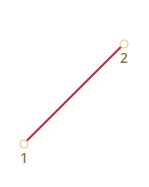
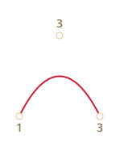
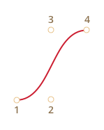
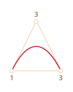
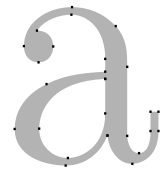
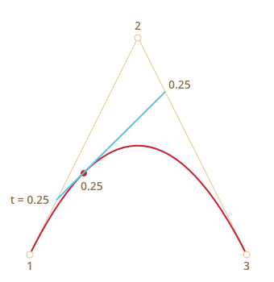
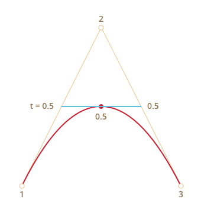

archive:
  ref: bezier-curve

---

# Кривые Безье

Кривые Безье используются в компьютерной графике для рисования плавных изгибов, в CSS-анимации и много где ещё.

Несмотря на "умное" название -- это очень простая штука.

В принципе, можно создавать анимацию и без знания кривых Безье, но стоит один раз изучить эту тему хотя бы для того, чтобы в дальнейшем с комфортом пользоваться этим замечательным инструментом. Тем более что в мире векторной графики и продвинутых анимаций без них никак.

## Виды кривых Безье

[Кривая Безье](https://ru.wikipedia.org/wiki/%D0%9A%D1%80%D0%B8%D0%B2%D0%B0%D1%8F_%D0%91%D0%B5%D0%B7%D1%8C%D0%B5) задаётся опорными точками.

Их может быть две, три, четыре или больше. Например:

По двум точкам:



По трём точкам:



По четырём точкам:



Если вы посмотрите внимательно на эти кривые, то "на глазок" заметите:

1. **Точки не всегда на кривой.** Это совершенно нормально, как именно строится кривая мы рассмотрим чуть позже.
2. **Степень кривой равна числу точек минус один**.
Для двух точек -- это линейная кривая (т.е. прямая), для трёх точек -- квадратическая кривая (парабола), для четырёх -- кубическая.
3. **Кривая всегда находится внутри [выпуклой оболочки](https://ru.wikipedia.org/wiki/%D0%92%D1%8B%D0%BF%D1%83%D0%BA%D0%BB%D0%B0%D1%8F_%D0%BE%D0%B1%D0%BE%D0%BB%D0%BE%D1%87%D0%BA%D0%B0), образованной опорными точками:**

     

    Благодаря последнему свойству в компьютерной графике можно оптимизировать проверку пересечений двух кривых. Если их выпуклые оболочки не пересекаются, то и кривые тоже не пересекутся.

Основная ценность кривых Безье для рисования -- в том, что, двигая точки, кривую можно менять, причём кривая при этом *меняется интуитивно понятным образом*.

Попробуйте двигать точки мышью в примере ниже:

[iframe src="demo.svg?nocpath=1&p=0,0,0.5,0,0.5,1,1,1" height=370]

**Как можно заметить, кривая натянута по касательным 1 -> 2 и 3 -> 4.**

После небольшой практики становится понятно, как расположить точки, чтобы получить нужную форму. А, соединяя несколько кривых, можно получить практически что угодно.

Вот некоторые примеры:

  

## Математика

У кривых Безье есть математическая формула.

Как мы увидим далее, для пользования кривыми Безье знать её нет особенной необходимости, но для полноты картины -- вот она.

**Координаты кривой описываются в зависимости от параметра `t⋲[0,1]`**

- Для двух точек:

    <code>P = (1-t)P<sub>1</sub> + tP<sub>2</sub></code>
- Для трёх точек:

    <code>P = (1−t)<sup>2</sup>P<sub>1</sub> + 2(1−t)tP<sub>2</sub> + t<sup>2</sup>P<sub>3</sub></code>
- Для четырёх точек:

    <code>P = (1−t)<sup>3</sup>P<sub>1</sub> + 3(1−t)<sup>2</sup>tP<sub>2</sub>  +3(1−t)t<sup>2</sup>P<sub>3</sub> + t<sup>3</sup>P<sub>4</sub></code>

Вместо <code>P<sub>i</sub></code>  нужно подставить координаты i-й опорной точки <code>(x<sub>i</sub>, y<sub>i</sub>)</code>.

Эти уравнения векторные, то есть для каждой из координат:

- <code>x = (1−t)<sup>2</sup>x<sub>1</sub> + 2(1−t)tx<sub>2</sub> + t<sup>2</sup>x<sub>3</sub></code>
- <code>y = (1−t)<sup>2</sup>y<sub>1</sub> + 2(1−t)ty<sub>2</sub> + t<sup>2</sup>y<sub>3</sub></code>

Вместо <code>x<sub>1</sub>, y<sub>1</sub>, x<sub>2</sub>, y<sub>2</sub>, x<sub>3</sub>, y<sub>3</sub></code> подставляются координаты трёх опорных точек, и в то время как `t` пробегает множество от `0` до `1`, соответствующие значения `(x, y)` как раз и образуют кривую.

Впрочем, это чересчур наукообразно, не очень понятно, почему кривые именно такие, и как зависят от опорных точек. С этим нам поможет разобраться другой, более наглядный алгоритм.

## Рисование "де Кастельжо"

[Метод де Кастельжо](https://ru.wikipedia.org/wiki/%D0%90%D0%BB%D0%B3%D0%BE%D1%80%D0%B8%D1%82%D0%BC_%D0%B4%D0%B5_%D0%9A%D0%B0%D1%81%D1%82%D0%B5%D0%BB%D1%8C%D0%B6%D0%BE) идентичен математическому определению кривой и наглядно показывает, как она строится.

Посмотрим его на примере трёх точек (точки можно двигать). Нажатие на кнопку "play" запустит демонстрацию.

[iframe src="demo.svg?p=0,0,0.5,1,1,0&animate=1" height=370]

**Алгоритм построения кривой по "методу де Кастельжо":**

1. Рисуем опорные точки. В примере выше это `1`, `2`, `3`.
2. Строятся отрезки между опорными точками 1 -> 2 -> 3. На рисунке выше они <span style="color:#825E28">коричневые</span>.
3. Параметр `t` пробегает значения от `0` до `1`. В примере выше использован шаг `0.05`, т.е. в цикле `0, 0.05, 0.1, 0.15, ... 0.95, 1`.

    Для каждого из этих значений `t`:

    - На каждом из <span style="color:#825E28">коричневых</span> отрезков берётся точка, находящаяся от начала на расстоянии от 0 до `t` пропорционально длине.  Так как коричневых отрезков -- два, то и точек две штуки.

        Например, при `t=0` -- точки будут в начале, при `t=0.25` -- на расстоянии в 25% от начала отрезка, при `t=0.5` -- 50%(на середине), при `t=1` -- в конце отрезков.

    - Эти точки соединяются. На рисунке ниже соединяющий их отрезок изображён <span style="color:blue">синим</span>.


| При `t=0.25`             | При `t=0.5`            |
| ------------------------ | ---------------------- |
|    |  |

4. На <span style="color:blue">получившемся</span> отрезке берётся точка на расстоянии, соответствующем `t`. То есть, для `t=0.25` (первый рисунок) получаем точку в конце первой четверти отрезка, для `t=0.5` (второй рисунок) -- в середине отрезка. На рисунках выше эта точка отмечена <span style="color:red">красным</span>.

5. По мере того как `t` пробегает последовательность от `0` до `1`, каждое значение `t` добавляет к красной кривой точку. **Совокупность таких точек для всех значений `t` образуют кривую Безье.**

Это был процесс для построения по трём точкам. Но то же самое происходит и с четырьмя точками.

Демо для четырёх точек (точки можно двигать):

[iframe src="demo.svg?p=0,0,0.5,0,0.5,1,1,1&animate=1" height=370]

Алгоритм:

- Точки по порядку соединяются отрезками: 1 -> 2, 2 -> 3, 3 -> 4. Получается три коричневых отрезка.
- На отрезках берутся точки, соответствующие текущему `t`, соединяются. Получается два <span style="color:#0A0">зелёных отрезка</span>.
- На этих отрезках берутся точки, соответствующие текущему `t`, соединяются. Получается один <span style="color:blue">синий отрезок</span>.
- На синем отрезке берётся точка, соответствующая текущему `t`. При запуске примера выше она <span style="color:red">красная</span>.
- Эти точки описывают кривую.

Этот алгоритм рекурсивен. Для каждого `t` из интервала от `0` до `1` по этому правилу, соединяя точки на соответствующем расстоянии, из 4 отрезков делается 3, затем из 3 так же делается 2, затем из 2 отрезков -- точка, описывающая кривую для данного значения `t`.

Нажмите на кнопку "play" в примере выше, чтобы увидеть это в действии.

Ещё примеры кривых:

[iframe src="demo.svg?p=0,0,0,0.75,0.25,1,1,1&animate=1" height=370]

С другими точками:

[iframe src="demo.svg?p=0,0,1,0.5,0,0.5,1,1&animate=1" height=370]

Петелька:

[iframe src="demo.svg?p=0,0,1,0.5,0,1,0.5,0&animate=1" height=370]

Пример негладкой кривой Безье:

[iframe src="demo.svg?p=0,0,1,1,0,1,1,0&animate=1" height=370]

Так как алгоритм рекурсивен, то аналогичным образом могут быть построены кривые Безье и более высокого порядка: по пяти точкам, шести и так далее. Однако на практике они менее полезны. Обычно используются 2-3 точки, а для сложных линий несколько кривых соединяются. Это гораздо проще с точки зрения поддержки и расчётов.

```smart header="Как провести кривую Безье *через* нужные точки?"
В задаче построения кривой Безье используются "опорные точки". Они, как можно видеть из примеров выше, не лежат на кривой. Точнее говоря, только первая и последняя лежат на кривой, а промежуточные -- нет.

Иногда возникает другая задача: провести кривую именно *через нужные точки*, чтобы все они лежали на некой плавной кривой, удовлетворяющей определённым требованиям. Такая задача называется [интерполяцией](https://ru.wikipedia.org/wiki/%D0%98%D0%BD%D1%82%D0%B5%D1%80%D0%BF%D0%BE%D0%BB%D1%8F%D1%86%D0%B8%D1%8F), и здесь мы её не рассматриваем.

Существуют математические формулы для таких построений, например [многочлен Лагранжа](https://ru.wikipedia.org/wiki/%D0%98%D0%BD%D1%82%D0%B5%D1%80%D0%BF%D0%BE%D0%BB%D1%8F%D1%86%D0%B8%D0%BE%D0%BD%D0%BD%D1%8B%D0%B9_%D0%BC%D0%BD%D0%BE%D0%B3%D0%BE%D1%87%D0%BB%D0%B5%D0%BD_%D0%9B%D0%B0%D0%B3%D1%80%D0%B0%D0%BD%D0%B6%D0%B0).

Как правило, в компьютерной графике для построения плавных кривых, проходящих через несколько точек, используют кубические кривые, плавно переходящие одна в другую. Это называется [интерполяция сплайнами](https://ru.wikipedia.org/wiki/%D0%9A%D1%83%D0%B1%D0%B8%D1%87%D0%B5%D1%81%D0%BA%D0%B8%D0%B9_%D1%81%D0%BF%D0%BB%D0%B0%D0%B9%D0%BD).
```

## Итого

Кривые Безье задаются опорными точками.

Мы рассмотрели два определения кривых:

1. Через математическую формулу.
2. Через процесс построения де Кастельжо.

Их удобство в том, что:

- Можно легко нарисовать плавные линии вручную, передвигая точки мышкой.
- Более сложные изгибы и линии можно составить, если соединить несколько кривых Безье.

Применение:

- В компьютерной графике, моделировании, в графических редакторах. Шрифты описываются с помощью кривых Безье.
- В веб-разработке -- для графики на Canvas или в формате SVG. Кстати, все живые примеры выше написаны на SVG. Фактически, это один SVG-документ, к которому точки передаются параметрами. Вы можете открыть его в отдельном окне и посмотреть исходник: [demo.svg](demo.svg?p=0,0,1,0.5,0,0.5,1,1&animate=1).
- В CSS-анимации, для задания траектории или скорости передвижения.
