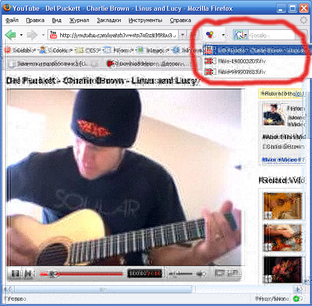

archive:
  ref: null

---

# Полезные расширения Firefox и Chrome

Здесь мы посмотрим ряд полезных расширений, которые, надеюсь, смогут вам пригодиться.

Если какое-то из расширений вас заинтересует -- его можно поставить. В Firefox расширения устанавливаются из меню "Инструменты -> Дополнения", в Chrome -- через меню "Настройки -> Расширения -> (внизу) Ещё расширения" или напрямую из "магазина" `https://chrome.google.com/webstore/category/home`.

Для расширений других браузеров такого единого способа нет.

## Web Developer (FF, Ch)

Это расширение добавляет наверх браузера панель с разнообразными инструментами:

Большинство возможностей, скорее, полезны для верстальщиков, но и для  разработчиков кое-что есть.

Например:

- **Disable Cache** -- полностью отключает кэш браузера
- **Disable Cookies** -- браузер перестанет посылать и принимать Cookie. Впрочем, Firebug это тоже умеет (вкладка Cookie)
- **Disable JavaScript** -- нужно редко, но иногда полезно
- **Resize** на нужное разрешение -- у разработчиков мониторы большие, а у пользователей разные. Можно добавить своё разрешение.

Иконок там много, поэтому наверняка вы чем-то не будете пользоваться. Лишние иконки можно убрать. В Firefox(Win) это делается так: Правый клик на панель -> Настроить -> Перетащить лишние иконки с панели.

## DNS Flusher (FF) / DNS Flusher for Chrome

Это расширение позволяет сбросить кэш DNS одним кликом.

Оно нужно в тех случаях, когда вы меняете адреса в файле `hosts` и хотите, чтобы изменения вступили в действие тут же.

При установке в статусной строке, снизу, появляется кнопочка с IP-адресом. По клику на ней кэш DNS сбрасывается.

## Более удобный Firebug (FF)

Здесь собраны расширения, улучшающие работу отладчика Firebug для Firefox.

Fire Rainbow
: Подсветка кода для Firebug

FireQuery
: Для разработки под jQuery -- выводит в разных местах вспомогательную информацию.

Firebug Autocompleter
: Включает автодополнение для консоли, когда она в многострочном режиме.

[CSS-X-Fire](http://code.google.com/p/css-x-fire/)
: Позволяет редактировать CSS в Firebug и сохранять изменения, интегрировано с редакторами от JetBrains (IntelliJ IDEA и другие).

## JsonView (FF,Ch)

Даёт возможность открыть JSON-документ прямо в браузере.

Обычно браузер не понимает `Content-Type: application/json` и пытается сохранить JSON-файлы.

Но если в нём стоит это расширение, то он покажет файл в удобном виде, с возможностью навигации:

## Xml Tree (Ch)

Расширение для просмотра XML для Chrome.

Остальные браузеры умеют это делать "из коробки".

## YSlow, PageSpeed Insights (FF, Ch)

Эти два расширения позволяют по-быстрому оценить скорость загрузки страницы, проанализировать массу возможных причин тормозов и получить советы по улучшению производительности.

Они очень похожи, но не идентичны, так что можно поставить оба.

## AdBlock (FF, Ch)

Расширение для отключения назойливой рекламы и баннеров.

Режет не всё, но многое. Да, оно не для разработки, но настолько полезное, что я не смог удержаться и опубликовал его здесь.

Кстати, насчёт разработки... Бывает так, что AdBlock прячет рекламу на сайтах, которые мы разрабатываем. К хорошему быстро привыкаешь, и если юзер будет слать вам ошибки на страницах (а у вас их нет) -- проверьте! Может быть, стоит отключить AdBlock для конкретной страницы и посмотреть без него? Исключения можно поставить в настройках расширения.

## DownloadHelper (FF)

Расширение для скачивания видео из Youtube, Blip TV и других хостингов.

С одной стороны, это расширение тоже напрямую не связано с разработкой...

..Но с другой -- бывает ли, что работая на компьютере вы получаете ссылку на интересное видео с конференции? Или заходите на сайт и видите там набор прекрасных выступлений, которые хочется скачать и посмотреть в более удобное время с планшетника. Скажем, во время поездки, когда нет интернет.

Если бывает, то это расширение -- для вас. Скачиваем отличные видео и смотрим, когда захотим.

Способ использования:

1. Зайти на страницу.
2. Начать смотреть видео.
3. Увидеть, как иконка расширения "ожила", кликнуть на неё и выбрать видео в нужном разрешении (если есть несколько).
4. Файл будет скачан в папку `dwhelper` (по умолчанию), место можно поменять в настройках.

## P.S.

В этот список расширений я включил самое любимое и полезное, что связано именно с расширениями браузера.

Есть дополнительные инструменты, которые становятся в систему, они идут в отдельном разделе.

У вас есть, что добавить? Расширения, которые вам очень помогли? Укажите их в комментариях.

